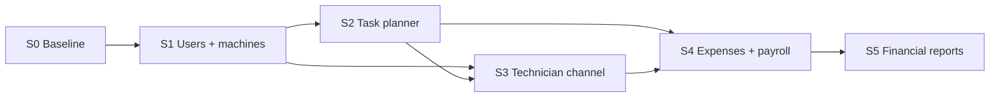

# Sprint: ERP «Водолій»

Планувальник · автомати · фінанси · зарплата

| | |
|---|---|
| **Базове TA** | [ta.md](./ta.md) |
| **Стек** | Next.js (`cabinet-vodolij24`) · Prisma · Telegram staff-bot |
| **Reuse** | `vending_machines`, `workers`, `StaffBotUser`, `tasks`, `/machines`, `/tasks` |
| **Оновлено** | 2026-08-10 |

### Прогрес

| Спринт | Статус |
|--------|--------|
| **S0** Baseline | ❌ |
| **S1** Users + machines | ❌ |
| **S2** Task planner + review | ⚠️ |
| **S3** Канал техніка | ⚠️ |
| **S4** Expenses + payroll | ❌ |
| **S5** Financial reports | ❌ |

**Легенда:** ✅ готово · ⚠️ код є, QA лишився · ❌ не почато

---

## Зміст

- [Зведення прогресу](#зведення-прогресу)
- [Мета спринту](#мета-спринту-загальна)
- [Загальні правила](#загальні-правила-з-ta)
- [S0 — Baseline](#s0--baseline-gap-аналіз-locked-defaults-)
- [S1 — Users + machines](#s1--users--roles--закріплення-автоматів-web-)
- [S2 — Task planner](#s2--task-planner--lifecycle--manager-review--75–80)
- [S3 — Канал техніка](#s3--канал-техніка-автомати--задачі--phone--70--telegram--15–20)
- [S4 — Payroll](#s4--щомісячні-витрати--payroll-)
- [S5 — Звітність](#s5--фінансова-звітність-)
- [Зведений checklist](#зведений-checklist-усі-спринти)
- [Exit criteria](#exit-criteria-epic)
- [Out of scope](#out-of-scope-цей-epic--v1)
- [Runbook](#runbook-чернетка)
- [Decision log](#decision-log-sprint)

---

## Зведення прогресу

| Спринт | Мета | Код | Перевірка | Примітка |
|--------|------|-----|-----------|----------|
| **S0** | Gap-аналіз схеми/UI vs TA; закрити Q2/Q3/Q5 | ❌ | ❌ | без продуктового деплою |
| **S1** | Користувачі/ролі + закріплення автоматів (web) | ❌ | ❌ | TA §3–4 |
| **S2** | Планувальник + lifecycle + перевірка керівником | ⚠️ | ⚠️ | ~75–80%: модель є; gaps: RBAC, dashboard review, tests |
| **S3** | Канал техніка: автомати + задачі | ⚠️ | ⚠️ | Phone + live ✅ bot→link; Telegram menus TBD |
| **S4** | Фінзвіт техніка + payroll | ❌ | ❌ | TA §7–8 |
| **S5** | Фінансова звітність | ❌ | ❌ | TA §9 |

---

## Мета спринту (загальна)

Реалізувати модуль ERP з TA:

- облік і закріплення автоматів
- планувальник операційних і фінансових задач
- утримання із ЗП
- щомісячні витрати техніків
- автоматичний розрахунок зарплати
- фінзвітність

### Канали (v1)

| Канал | Хто | Що |
|-------|-----|-----|
| **Web (dashboard)** | керівник, фінансист | створення задач, управління |
| **Public phone** `/(public)/[phone]` | технік + керівник | виконання / review *(фактичний канал)* |
| **Telegram** | staff | `/start` + notify; меню техніка **ще не** як у TA |

> **Критично (TA §10):** модульно, additive; не ламати `/machines`, `/tasks`, mailing, public flows без явного рішення в sprint-задачі.

---

## Загальні правила (з TA)

| # | Правило |
|---|---------|
| **R1** | 1 автомат → **1** відповідальний технік (B1–B5) |
| **R2** | UI лише **«Утримання із заробітної плати»**; «штраф» заборонене (B7) |
| **R3** | Утримання — лише **цілі** грн (B8) |
| **R4** | Lifecycle: виконати/відхилити → очікує керівника → прийняв / не прийняв (B9–B10) |
| **R5** | Payroll: `base + performance_bonus + manual_bonuses − deductions` |
| **R6** | Касир / Площина / ЗП техніку в боті — **OOS v1**. Фото задач — **вже є** |
| **R7** | UI може уточнюватись; **модель даних і статуси** — locked |
| **R8** | Перед prod: регресія machines / tasks / auth |

### Залежності між спринтами



---

## S0 — Baseline, gap-аналіз, locked defaults ❌

**Мета:** зіставити Prisma/UI з TA; зафіксувати відповіді на open questions (або defaults), щоб S1+ не блокувались.

### Задачі

| ID | Статус | Задача | Результат |
|----|--------|--------|-----------|
| S0-1 | ❌ | Інвентаризація моделей | — |
| S0-2 | ❌ | Gap-матриця: є / дописати / deprecate | таблиця в кінці S0 |
| S0-3 | ❌ | Q2: мережа / літри — усі vs активні | **зафіксувати default** |
| S0-4 | ❌ | Q3: знімок `machines_count` для payroll | **зафіксувати default** |
| S0-5 | ❌ | Q5: коли створювати щомісячну фінзадачу | **зафіксувати default** |
| S0-6 | ❌ | Q1: web-first vs bot-first | default: **web-first** |
| S0-7 | ❌ | Оновити TA §13 після рішень | `docs/ta.md` |

### Чекліст приймання S0

- [ ] Gap-матриця погоджена
- [ ] Defaults для Q1–Q3, Q5 у TA decision log
- [ ] Go для S1

**Деплой:** не потрібен.

### Recommended defaults

| Q | Default |
|---|---------|
| **Q1** | Створення задач — **web**; Telegram — список / виконання / відхилення |
| **Q2** | Мережа = **усі** автомати в БД; літри — сума за календарний місяць |
| **Q3** | `machines_count` = автомати техніка **на кінець** розрахункового місяця |
| **Q5** | Автозадача витрат — **1-ше число** наступного місяця (або cron 01.xx 06:00) |

---

## S1 — Users / roles + закріплення автоматів (web) ❌

**Мета:** ролі Керівник / Технік / Фінансист; web: список автоматів, фільтр, reassign (B1–B5).

### Задачі

| ID | Статус | Задача | Файли |
|----|--------|--------|-------|
| S1-1 | ❌ | Модель/ролі (+ reserved касир/площина) | `prisma/schema.prisma` |
| S1-2 | ❌ | User fields: ім’я, прізвище, Telegram ID, role(s) | schema + API |
| S1-3 | ❌ | Machine fields v1 | reuse `vending_machines` |
| S1-4 | ❌ | API: list / filter / reassign | `app/api/machines` |
| S1-5 | ❌ | Web UI таблиця + зміна відповідального | `app/(dashboard)/machines` |
| S1-6 | ❌ | Після reassign: зникає у старого / з’являється у нового | tests / manual |
| S1-7 | ❌ | RBAC: лише керівник/адмін змінює assignment | CabinetAccess |

### Чекліст приймання S1

- [ ] Керівник бачить усі автомати і фільтр по техніку
- [ ] Reassign атомарно (1 технік на автомат)
- [ ] Існуючий machines flow без регресії
- [ ] Go для S2/S3

**Деплой:** після QA на staging.

---

## S2 — Task planner + lifecycle + manager review ⚠️ (~75–80%)

**Мета:** операційні/фінансові задачі (§5); статуси (§6); перевірка B9/B10; утримання без «штраф».

**Audit 2026-08-10:** ядро вже в коді. Живий планувальник = `tasks` *(не `maintenance_tasks`)*.

### Статуси в коді (vs TA)

| TA | Код (`lib/task-fields.ts`) |
|----|----------------------------|
| created / assigned | `todo` |
| done_pending | `awaiting_manager_confirm` |
| rejected_pending | `awaiting_manager_decision` |
| closed_no_deduction | `done` + `managerDecision=accepted` |
| closed_with_deduction | `done` + `managerDecision=rejected` + `deductionApplied` |

### Задачі

| ID | Статус | Задача | Нотатки |
|----|--------|--------|---------|
| S2-1 | ✅ | Модель задачі §5.2 | `tasks` |
| S2-2 | ✅ | Типи + schedule + `periodKey` | `generate-monthly` |
| S2-3 | ✅ | Assignees: один / кілька / роль | `groupId` |
| S2-4 | ✅ | Утримання ×100; без «штраф» | UI + parse |
| S2-5 | ⚠️ | Lifecycle є; назви статусів ≠ TA | опційно вирівняти |
| S2-6 | ⚠️ | Web create є; **немає** gating manager/financier | RBAC |
| S2-7 | ⚠️ | Review на **phone UI**; dashboard лише list | dashboard review TBD |
| S2-8 | ⚠️ | `deductionApplied` є; payroll ledger — S4 | |
| S2-9 | ❌ | Unit/integration lifecycle + B9/B10 | тестів немає |

### Чекліст приймання S2

- [x] Створення operational + financial (§5.2)
- [x] Прийняв → без утримання; не прийняв → `deductionApplied` (phone)
- [x] Немає слова «штраф»
- [ ] Role×type create gating
- [ ] Accept/reject у **dashboard**
- [ ] Автотести lifecycle
- [ ] Go для S4 payroll feed

**Залишок:** S2-5 naming · S2-6 RBAC · S2-7 dashboard review · S2-8 ledger→S4 · S2-9 tests

---

## S3 — Канал техніка: автомати + задачі ⚠️

Phone ✅ ≈70% · Telegram ❌ ≈15–20%

**Мета (TA):** технік бачить лише свої автомати (літри) і задачі; Виконати / Відхилити.

**Audit 2026-08-10:** продуктовий канал = **public phone** `/(public)/[phone]`, не Telegram-меню.

### Live test ✅

> Колега → staff-bot **Старт** → роль **технік** → задача → з’явилась у боті (лінк) → phone UI → **виконано**.

### Задачі

| ID | Статус | Задача | Нотатки |
|----|--------|--------|---------|
| S3-1 | ✅ path | `/start` → `workers.chat_id`; роль у Settings | Live ✅ |
| S3-2 | ⚠️ | «Мої автомати» — ✅ phone; ❌ Telegram menus | `technician-public` |
| S3-3 | ✅ path | Задача в бот (notify/лінк); ✅ phone UI | Live ✅ |
| S3-4 | ✅ path | Виконати + коментар → `awaiting_manager_confirm` | Live ✅ |
| S3-5 | ⚠️ | Відхилити — ✅ phone; ❌ Telegram | |
| S3-6 | ⚠️ | ACL phone+role; автотестів мало | |
| S3-7 | ✅ | Фото реалізовано (`photoUrls`) | `task-photos` |

### Чекліст приймання S3

- [x] Технік A ≠ чужі автомати/задачі (phone ACL)
- [x] Після Виконати/Відхилити — черга керівника
- [x] Літри на phone UI
- [x] **Live:** `/start` → роль → бот-лінк → phone → виконано
- [ ] Повне Telegram-меню (якщо лишається в scope)
- [ ] Автотести ACL
- [ ] Go для S4

**Залишок:** formalize **бот = notify + deep-link** як v1 **або** дописувати Telegram menus.

---

## S4 — Щомісячні витрати + payroll ❌

**Мета:** автозадача фінзвіту (паливо / інші); ЗП раз на місяць; web-перегляд; ручні премії.

### Задачі

| ID | Статус | Задача | Файли |
|----|--------|--------|-------|
| S4-1 | ❌ | Модель expense report | prisma |
| S4-2 | ❌ | Cron: financial task кожному техніку | job / API |
| S4-3 | ❌ | Flow заповнення фінзадачі | bot / phone |
| S4-4 | ❌ | Payroll run за §8.2 | `lib/payroll/*` |
| S4-5 | ❌ | Збереження payroll (idempotent) | prisma + service |
| S4-6 | ❌ | Ручна премія | API + web |
| S4-7 | ❌ | Утримання = сума `deductionApplied` за період | service |
| S4-8 | ❌ | Web UI payroll detail + місяць | dashboard |
| S4-9 | ❌ | Тести формули | unit |

### Чекліст приймання S4

- [ ] Технік подав паливо/інші; запис збережено
- [ ] `salary = base + bonus + manual − deductions` на фікстурах
- [ ] Повторний payroll за місяць не дублює рядки
- [ ] Керівник і фінансист бачать деталізацію
- [ ] Go для S5

**Деплой:** staging smoke на 1–2 техніках → prod.

---

## S5 — Фінансова звітність ❌

**Мета:** звіт для фінансиста/керівника; пресети періодів; drill-down (TA §9).

### Задачі

| ID | Статус | Задача | Файли |
|----|--------|--------|-------|
| S5-1 | ❌ | Period resolver (7d / month / quarter / year / custom) | `lib/reports/*` |
| S5-2 | ❌ | Aggregates: fuel / other / payroll | API |
| S5-3 | ❌ | Drill-down §9.2 | API + UI |
| S5-4 | ❌ | Default = поточний місяць | UI |
| S5-5 | ❌ | RBAC: фінансист + керівник | access |
| S5-6 | ❌ | Manual QA AC §11 пункти 6–8 | checklist |

### Чекліст приймання S5

- [ ] Усі пресети періодів коректні
- [ ] Drill-down збігається з S4
- [ ] TA §11 — закрито або deferred

**Деплой:** після S4 prod-stable.

---

## Зведений checklist (усі спринти)

| # | Задача | Спринт | Статус |
|---|--------|--------|--------|
| 1 | Gap-аналіз + defaults Q1–Q3, Q5 | S0 | [ ] |
| 2 | Ролі + user fields | S1 | [ ] |
| 3 | Reassign автоматів (web) | S1 | [ ] |
| 4 | Модель задач + статуси + утримання | S2 | [x] ⚠️ naming ≠ TA |
| 5 | Review керівником (B9/B10) | S2 | [x] ⚠️ phone; dashboard — ні |
| 6 | Технік: мої автомати + літри | S3 | [x] ⚠️ phone; Telegram — ні |
| 7 | Технік: виконати / відхилити | S3 | [x] ✅ live bot→phone |
| 8 | Місячний expense report + cron | S4 | [ ] |
| 9 | Payroll + web + manual bonus | S4 | [ ] |
| 10 | Financial report + drill-down | S5 | [ ] |

---

## Exit criteria (epic)

| # | Критерій (TA §11) | Спринт | Audit |
|---|-------------------|--------|-------|
| 1 | Reassign оновлює списки | S1 | — |
| 2 | Технік бачить лише свої автомати з літрами | S3 | ⚠️ phone |
| 3 | Створення задач §5.2 | S2 | ✅ |
| 4 | Виконати/відхилити → очікує керівника | S2+S3 | ✅ live |
| 5 | Прийняв / не прийняв (± утримання) | S2 | ✅ phone |
| 6 | Фінзадача зберігає витрати | S4 | — |
| 7 | Зарплата §8.2 у web | S4 | — |
| 8 | Фінзвіт + drill-down | S5 | — |
| 9 | Немає «штраф» у UI | S2+ | ✅ |

---

## Out of scope (цей epic / v1)

- ~~Фото до задач~~ — **вже реалізовано**
- Зарплата техніка в Telegram/кабінеті
- Ролі Касир / Площина
- Полірування фінального UX (окремі UI-спринти)
- Telegram-меню техніка — **відкрите рішення**: phone як v1 **або** дописати bot

---

## Runbook (чернетка)

### Після S0

1. Оновити `docs/ta.md` §13–14 рішеннями
2. Стартувати S1 міграціями ролей/assignment

### Після S1–S2 (staging)

```bash
npm run build
npx prisma migrate deploy
# smoke: reassign machine → list by technician
# smoke: create task → done → manager accept/reject
```

### Після S3 (phone / bot)

1. Smoke phone: технік A / B ACL
2. Виконати + Відхилити → черга керівника
3. Зафіксувати phone як v1-канал у TA **або** дописати Telegram menus

### Після S4–S5

1. Тригер місячної фінзадачі (cron або admin)
2. Payroll dry-run → apply
3. Фінзвіт: current month + custom range

---

## Decision log (sprint)

| Дата | Рішення |
|------|---------|
| 2026-08-10 | Sprint-план у стилі MM_project `*-sprint.md` |
| 2026-08-10 | Розбиття: S0 → S1 → S2 → S3 → S4 → S5 |
| 2026-08-10 | Web-first створення задач; bot — виконання (proposed default) |
| 2026-08-10 | **Audit S2/S3:** S2 ⚠️ ~75–80%; S3 phone ≈70%, Telegram ≈15–20%; фото ✅ |
| 2026-08-10 | Статуси: `todo` / `awaiting_manager_*` / `done` + `managerDecision` |
| 2026-08-10 | **Live ✅:** `/start` → роль → бот-лінк → phone → виконано. V1 = notify + public link |
