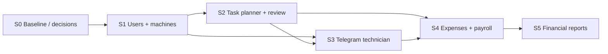

# Sprint: ERP «Водолій» — планувальник, автомати, фінанси, зарплата

**Базове TA:** [ta.md](./ta.md)  
**Стек:** Next.js cabinet (`cabinet-vodolij24`) · Prisma · Telegram staff-bot  
**Існуюча база (reuse):** `vending_machines`, `technicians`, `tasks` / `maintenance_tasks`, `StaffBotUser`, `workers`, dashboard `/machines`, `/tasks`  
**Статус:** **S0 ❌ · S1 ❌ · S2 ⚠️ · S3 ⚠️ · S4 ❌ · S5 ❌**  
**Оновлено:** 2026-08-10 (audit: S2/S3 vs codebase)

### Зведення прогресу

| Спринт | Мета | Код | Перевірка | Примітка |
|--------|------|-----|-----------|----------|
| **S0** | Baseline: gap-аналіз схеми/UI vs TA; закрити Q2/Q3/Q5 або зафіксувати defaults | ❌ | ❌ | без продуктового деплою |
| **S1** | Користувачі/ролі + закріплення автоматів (web) | ❌ | ❌ | TA §3–4 |
| **S2** | Планувальник задач + lifecycle + перевірка керівником | ⚠️ | ⚠️ | ~75–80%: модель/lifecycle є; gaps: role×type, dashboard review, tests |
| **S3** | Канал техніка: автомати + задачі (виконати/відхилити) | ⚠️ | ⚠️ | Phone + **live ✅** bot `/start`→link→complete; повні Telegram menus TBD |
| **S4** | Щомісячний фінзвіт техніка + payroll (формула + web view) | ❌ | ❌ | TA §7–8 |
| **S5** | Фінансова звітність (періоди + drill-down) | ❌ | ❌ | TA §9 |

**Легенда:** ✅ готово · ⚠️ код є, QA лишився · ❌ не почато

---

## Мета спринту (загальна)

Реалізувати модуль ERP з TA: облік/закріплення автоматів, планувальник операційних і фінансових задач, утримання із ЗП, щомісячні витрати техніків, автоматичний розрахунок зарплати та фінзвітність.

**Канали (v1):**

- **Web (dashboard)** — керівник, фінансист (створення задач)  
- **Public phone UI** `/(public)/[phone]` — технік + перевірка керівником (**фактичний** канал виконання/review)  
- **Telegram** — staff `/start` + notify; меню техніка **ще не** як у TA  

**Критично (з TA §10):** модульно, additive; не ламати вже робочі `/machines`, `/tasks`, mailing, public flows без явного рішення в sprint-задачі.

---

## Загальні правила (з TA)

| # | Правило |
|---|---------|
| R1 | 1 автомат → **1** відповідальний технік (B1–B5). |
| R2 | UI-термін лише **«Утримання із заробітної плати»**; слово «штраф» заборонене (B7). |
| R3 | Утримання — лише **цілі** грн (B8). |
| R4 | Lifecycle задач: виконати/відхилити → очікує керівника → прийняв / не прийняв (+/− утримання) (B9–B10). |
| R5 | Payroll: `base + performance_bonus + manual_bonuses − deductions` (TA §8.2). |
| R6 | Касир / Площина / зарплата техніку в боті — **out of scope v1** (TA §12). Фото задач — **вже є** (не блокувати). |
| R7 | Точний UI web/Telegram може уточнюватись; **модель даних і статуси** — locked з TA. |
| R8 | Перед prod: регресія існуючих machines/tasks/auth flows. |

### Залежності між спринтами



---

## S0 — Baseline, gap-аналіз, locked defaults ❌

**Мета:** зіставити поточну Prisma/UI з TA; зафіксувати відповіді на open questions (або тимчасові defaults), щоб S1+ не блокувались.

### Задачі

| ID | Статус | Задача | Результат |
|----|--------|--------|-----------|
| S0-1 | ❌ | Інвентаризація моделей: `vending_machines`, `technicians`, `tasks`, `maintenance_tasks`, `StaffBotUser`, `workers`, `CabinetAccess` | — |
| S0-2 | ❌ | Gap-матриця: що вже є / що дописувати / що deprecate | таблиця в кінці S0 |
| S0-3 | ❌ | Q2: `network_machines_count` / літри — усі автомати vs активні | **зафіксувати default** |
| S0-4 | ❌ | Q3: знімок `machines_count` для payroll (кінець місяця / інше) | **зафіксувати default** |
| S0-5 | ❌ | Q5: коли створювати щомісячну фінзадачу | **зафіксувати default** |
| S0-6 | ❌ | Q1: web-first vs bot-first для створення задач | default: **web-first**, bot — виконання |
| S0-7 | ❌ | Оновити TA §13 (Open questions) після рішень | `docs/ta.md` |

### Чекліст приймання S0

- [ ] Gap-матриця погоджена.  
- [ ] Defaults для Q1–Q3, Q5 записані в TA decision log.  
- [ ] Go для S1.

**Деплой:** не потрібен.

### Recommended defaults (якщо stakeholder не відповів)

| Q | Default (пропонований) |
|---|------------------------|
| Q1 | Створення задач — **web**; Telegram — список/виконання/відхилення |
| Q2 | Мережа = **усі** автомати в БД на момент розрахунку; літри — сума за календарний місяць |
| Q3 | `machines_count` = кількість автоматів техніка **станом на кінець** розрахункового місяця |
| Q5 | Автозадача витрат — **1-ше число** наступного місяця за попередній період (або cron 01.xx 06:00) |

---

## S1 — Users / roles + закріплення автоматів (web) ❌

**Мета:** ролі Керівник / Технік / Фінансист; поля користувача; web: список автоматів, фільтр по техніку, зміна відповідального (B1–B5).

### Задачі

| ID | Статус | Задача | Файли (орієнтовно) |
|----|--------|--------|-------------------|
| S1-1 | ❌ | Модель/ролі: керівник, технік, фінансист (+ reserved касир/площина) | `prisma/schema.prisma`, seed/migration |
| S1-2 | ❌ | User fields: ім’я, прізвище, Telegram ID, role(s) | schema + API |
| S1-3 | ❌ | Machine fields v1: назва, адреса, локація, responsible technician | reuse/extend `vending_machines` |
| S1-4 | ❌ | API: list all / filter by technician / reassign | `app/api/machines`, `actions/*` |
| S1-5 | ❌ | Web UI: таблиця автоматів + зміна відповідального | `app/(dashboard)/machines` |
| S1-6 | ❌ | Після reassign: автомат зникає у старого / з’являється у нового (перевірка) | tests / manual |
| S1-7 | ❌ | RBAC: лише керівник (і за потреби адмін) змінює assignment | middleware / CabinetAccess |

### Чекліст приймання S1

- [ ] Керівник бачить усі автомати і фільтр по техніку.  
- [ ] Reassign оновлює ownership атомарно (1 технік на автомат).  
- [ ] Існуючий machines flow без регресії.  
- [ ] Go для S2/S3.

**Деплой:** можна після QA на staging.

---

## S2 — Task planner + lifecycle + manager review ⚠️ (~75–80%)

**Мета:** операційні/фінансові задачі з полями TA §5; статуси §6; перевірка керівником B9/B10; утримання без слова «штраф».

**Audit 2026-08-10:** ядро вже в коді. `maintenance_tasks` у Prisma **не використовується** app-ом — живий планувальник = `tasks`.

### Статуси в коді (vs TA)

| TA | Code (`lib/task-fields.ts`) |
|----|------------------------------|
| created / assigned | `todo` (create одразу в `todo`) |
| done_pending | `awaiting_manager_confirm` |
| rejected_pending | `awaiting_manager_decision` |
| closed_no_deduction | `done` + `managerDecision=accepted` |
| closed_with_deduction | `done` + `managerDecision=rejected` + `deductionApplied` |

### Задачі

| ID | Статус | Задача | Файли / нотатки |
|----|--------|--------|-----------------|
| S2-1 | ✅ | Уніфікована модель задачі під поля §5.2 | `prisma/schema.prisma` → `tasks` |
| S2-2 | ✅ | Типи operational / financial; `schedule` once/monthly; `periodKey` | schema + `lib/task-fields.ts`; `POST /api/tasks/generate-monthly` |
| S2-3 | ✅ | Assignees: один / кілька / роль (fan-out + `groupId`) | `app/api/tasks/route.ts`, `driver-form.tsx` |
| S2-4 | ✅ | Утримання: optional int (×100); label «Утримання із заробітної плати»; без «штраф» | `parseSalaryDeduction`, dashboard + public UI |
| S2-5 | ⚠️ | Lifecycle є; назви статусів **не** як у TA (див. таблицю вище) | `TASK_STATUS`, public technician/manager APIs |
| S2-6 | ⚠️ | Web створення задач є; **немає** gating manager→ops / financier→financial | `app/(dashboard)/tasks/**` |
| S2-7 | ⚠️ | Review accept/reject на **phone UI**; dashboard лише list/filter awaiting | `app/(public)/[phone]`, `api/public/manager/...` |
| S2-8 | ⚠️ | `deductionApplied` на задачі при reject; **окремого payroll ledger немає** (S4) | `api/public/manager/.../tasks/[taskId]` |
| S2-9 | ❌ | Unit/integration: lifecycle + B9/B10 | тестів не знайдено |

### Чекліст приймання S2

- [x] Створення operational + financial з полями §5.2 (через dashboard).  
- [x] Прийняв → `done` без утримання; не прийняв → `done` + `deductionApplied` (phone manager UI).  
- [x] У UI немає слова «штраф».  
- [ ] Role×type create gating (керівник / фінансист).  
- [ ] Accept/reject у **dashboard** (зараз лише phone).  
- [ ] Автотести lifecycle.  
- [ ] Go для S4 payroll feed з `deductionApplied`.

**Залишок S2:** S2-5 naming (опційно), S2-6 RBAC, S2-7 dashboard review, S2-8 ledger→S4, S2-9 tests.

---

## S3 — Канал техніка: автомати + задачі ⚠️ (phone ✅≈70% · Telegram ❌≈15–20%)

**Мета (TA):** технік бачить лише свої автомати (літри) і задачі; Виконати / Відхилити (§4.4, §6.1).

**Audit 2026-08-10:** продуктовий канал = **public phone web** `/(public)/[phone]`, не Telegram-меню. Telegram: `StaffBotUser` `/start` + notify при create/update.

**Live test 2026-08-10 (manual):** колега → Telegram staff-bot **Старт** → керівник присвоїв роль **технік** → створено задачу на нього → задача **з’явилась у боті** (посилання) → перейшов за публічним лінком → **закрив як виконану**. ✅ цей шлях працює.

### Задачі

| ID | Статус | Задача | Файли / нотатки |
|----|--------|--------|-----------------|
| S3-1 | ⚠️→✅ path | `StaffBotUser` + `workers.chat_id` через `/start`; роль ставить керівник у Settings | **Live ✅:** /start → assign technician → task notify |
| S3-2 | ⚠️ | «Мої автомати» — **не** в Telegram; ✅ на phone UI (назва, адреса, локація, літри) | `lib/technician-public.ts`, `app/(public)/[phone]` |
| S3-3 | ⚠️→✅ path | Задача доходить у бот (notify/посилання); повний список «мої задачі» в меню бота — TBD; ✅ phone UI | **Live ✅:** задача в боті → лінк → phone UI |
| S3-4 | ⚠️→✅ path | Виконати + коментар → `awaiting_manager_confirm` — ✅ phone (із бот-лінка); Telegram inline complete — TBD | **Live ✅:** закрив як виконану з лінка з бота |
| S3-5 | ⚠️ | Відхилити + причина → `awaiting_manager_decision` — ✅ phone; ❌ Telegram | same |
| S3-6 | ⚠️ | ACL phone+role (технік A ≠ B); автотестів мало/немає | `technician-public` / `manager-public` |
| S3-7 | ✅ | Фото — **реалізовано** (`photoUrls`, multipart), понад v1 «stub only» | `lib/task-photos.ts` |

### Чекліст приймання S3

- [x] Технік A не бачить чужі автомати/задачі (phone ACL).  
- [x] Після Виконати/Відхилити задача в черзі керівника (phone manager).  
- [x] Літри на phone UI з джерела статистики.  
- [x] **Live:** `/start` → роль техніка → задача в боті (лінк) → phone UI → виконано.  
- [ ] Повне Telegram-меню (список автоматів/задач без web-лінка) — якщо лишається в scope.  
- [ ] Автотести ACL.  
- [ ] Go для S4 фінфлоу (phone або bot — зафіксувати канал).

**Залишок S3:** formalize **бот = notify + deep-link на phone UI** як v1-канал (підтверджено live), **або** дописувати повні Telegram menus.

---

## S4 — Щомісячні витрати + payroll ❌

**Мета:** автозадача фінзвіту техніка (паливо / інші); розрахунок ЗП раз на місяць; web-перегляд для керівника/фінансиста; ручні премії.

### Задачі

| ID | Статус | Задача | Файли (орієнтовно) |
|----|--------|--------|-------------------|
| S4-1 | ❌ | Модель expense report: період, технік, паливо+коментар, інші+коментар, дата подання | prisma |
| S4-2 | ❌ | Cron/job: створити financial task кожному техніку (S0 default Q5) | job / API admin trigger |
| S4-3 | ❌ | Telegram flow заповнення фінзадачі | bot |
| S4-4 | ❌ | Payroll run: snapshot machines_count, avg liters, components §8.2 | `lib/payroll/*` |
| S4-5 | ❌ | Збереження результату payroll за місяць (idempotent per technician+period) | prisma + service |
| S4-6 | ❌ | Ручна премія: сума, причина, автор, дата | API + web |
| S4-7 | ❌ | Утримання в payroll = сума `closed_with_deduction` за період | service |
| S4-8 | ❌ | Web UI payroll detail (§8.4) + вибір місяця | `app/(dashboard)/…` |
| S4-9 | ❌ | Тести формули на фікстурах | unit tests |

### Чекліст приймання S4

- [ ] Технік подав паливо/інші; запис збережено.  
- [ ] `salary = base + bonus + manual − deductions` на тестових даних.  
- [ ] Повторний payroll за той самий місяць не дублює рядки (перерахунок/upsert).  
- [ ] Керівник і фінансист бачать деталізацію.  
- [ ] Go для S5.

**Деплой:** staging smoke на 1–2 техніках → prod.

---

## S5 — Фінансова звітність ❌

**Мета:** звіт для фінансиста/керівника: паливо, інші витрати, ЗП; пресети періодів; drill-down (TA §9).

### Задачі

| ID | Статус | Задача | Файли (орієнтовно) |
|----|--------|--------|-------------------|
| S5-1 | ❌ | Period resolver: 7d / current / prev / 2m / quarter / year / custom | `lib/reports/*` |
| S5-2 | ❌ | Aggregates: fuel total, other total, payroll total | API |
| S5-3 | ❌ | Drill-down fuel / other / payroll (§9.2) | API + UI |
| S5-4 | ❌ | Default open = поточний календарний місяць | UI |
| S5-5 | ❌ | RBAC: фінансист + керівник | access |
| S5-6 | ❌ | Manual QA сценарії AC §11 пункти 6–8 | checklist |

### Чекліст приймання S5

- [ ] Усі пресети періодів повертають коректні межі.  
- [ ] Drill-down збігається з детальними записами S4.  
- [ ] TA §11 acceptance — усі пункти закриті або позначені deferred.  

**Деплой:** після S4 prod-stable.

---

## Зведений checklist (усі спринти)

| # | Задача | Спринт | Статус |
|---|--------|--------|--------|
| 1 | Gap-аналіз + defaults Q1–Q3, Q5 | S0 | [ ] |
| 2 | Ролі + user fields | S1 | [ ] |
| 3 | Reassign автоматів (web) | S1 | [ ] |
| 4 | Модель задач + статуси + утримання | S2 | [x] ⚠️ naming ≠ TA |
| 5 | Review керівником (B9/B10) | S2 | [x] ⚠️ phone UI; dashboard — ні |
| 6 | Технік: мої автомати + літри | S3 | [x] ⚠️ phone; Telegram — ні |
| 7 | Технік: виконати / відхилити | S3 | [x] ✅ live: бот notify → phone → виконано |
| 8 | Місячний expense report + cron | S4 | [ ] |
| 9 | Payroll formula + web view + manual bonus | S4 | [ ] |
| 10 | Financial report periods + drill-down | S5 | [ ] |

---

## Exit criteria (epic)

| # | Criterion (з TA §11) | Спринт | Audit |
|---|----------------------|--------|-------|
| 1 | Reassign техніка оновлює списки | S1 | — |
| 2 | Технік бачить лише свої автомати з літрами | S3 | ⚠️ phone UI |
| 3 | Створення задач з полями §5.2 | S2 | ✅ |
| 4 | Виконати/відхилити → очікує керівника | S2+S3 | ✅ phone + **live** bot→link |
| 5 | Прийняв / не прийняв (± утримання) | S2 | ✅ phone |
| 6 | Щомісячна фінзадача зберігає витрати | S4 | — |
| 7 | Зарплата за §8.2 у web | S4 | — |
| 8 | Фінзвіт з пресетами + drill-down | S5 | — |
| 9 | Немає слова «штраф» у UI | S2+ | ✅ |

---

## Out of scope (цей epic / v1)

- ~~Фото до задач~~ — **вже реалізовано** (`lib/task-photos.ts`); лишалось у старому OOS.  
- Зарплата техніка в Telegram/кабінеті.  
- Ролі Касир / Площина.  
- Полірування фінального UX (окремі UI-спринти).  
- Telegram-меню техніка — **відкрите рішення**: formalize phone як v1 **або** дописати bot (S3 залишок).  

---

## Runbook (чернетка)

### Після S0

1. Оновити `docs/ta.md` §13–14 рішеннями.  
2. Стартувати S1 міграціями ролей/assignment.

### Після S1–S2 (staging)

```bash
npm run build
npx prisma migrate deploy
# smoke: reassign machine → list by technician
# smoke: create task → mark done (API) → manager accept/reject
```

### Після S3 (phone / bot)

1. Smoke phone: технік A / B ACL на автомати й задачі.  
2. Виконати + Відхилити → черга керівника на `/(public)/[phone]` (manager).  
3. Якщо scope = Telegram: дописати меню/actions; інакше зафіксувати phone як v1-канал у TA.

### Після S4–S5

1. Тригер місячної фінзадачі (cron або admin).  
2. Payroll dry-run на фікстурах → apply.  
3. Фінзвіт: current month default + custom range.

---

## Decision log (sprint)

| Date | Decision |
|------|----------|
| 2026-08-10 | Sprint-план створено за стилем MM_project `*-sprint.md`. |
| 2026-08-10 | Розбиття: S0 baseline → S1 machines/users → S2 tasks → S3 telegram → S4 payroll → S5 reports. |
| 2026-08-10 | Web-first створення задач; bot — виконання (proposed default до відповіді на Q1). |
| 2026-08-10 | **Audit S2/S3:** S2 ⚠️ ~75–80% (S2-1…4 ✅; S2-5…8 ⚠️; S2-9 ❌). S3 ⚠️ phone UI ≈70%, Telegram menus ≈15–20%. Фото вже є (S3-7 ✅). |
| 2026-08-10 | Статуси задач у коді: `todo` / `awaiting_manager_confirm` / `awaiting_manager_decision` / `done` + `managerDecision`. |
| 2026-08-10 | **Live ✅:** `/start` → роль техніка → задача в боті (посилання) → phone UI → виконано. V1-канал = bot notify + public link, не повне Telegram-меню. |
