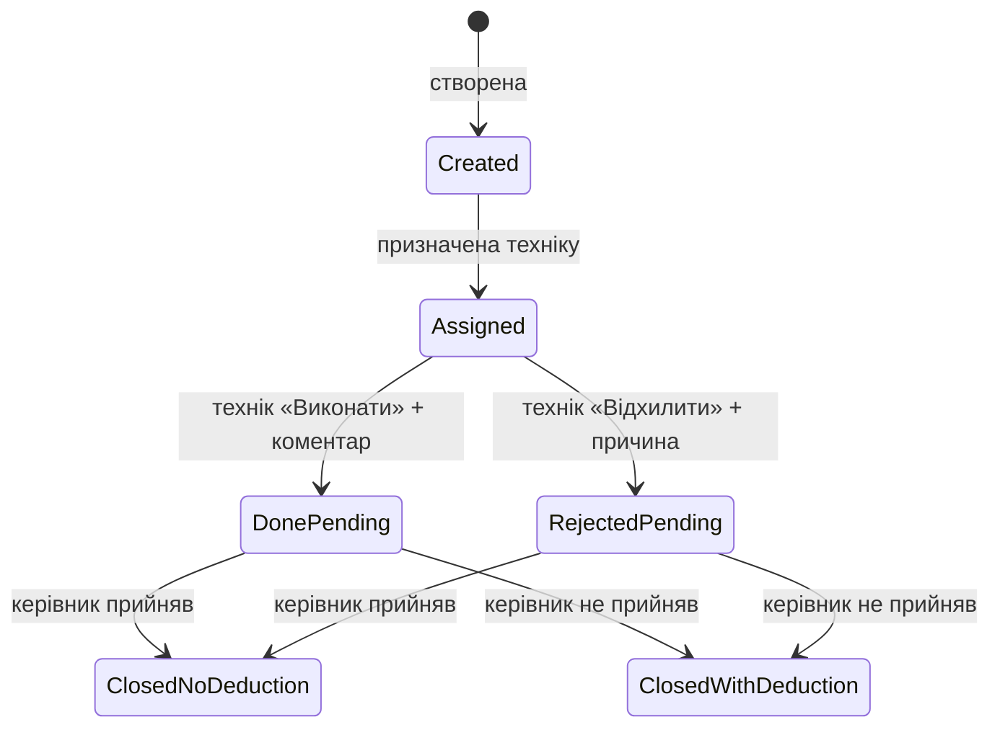

# TA: ERP «Водолій»

Планувальник · автомати · фінанси · зарплата

| | |
|---|---|
| **Статус** | Draft — product TA *(ще не все реалізовано)* |
| **Sprint-план** | [ta-sprint.md](./ta-sprint.md) |
| **Дата** | 2026-08-10 |
| **Канали** | Web (керівник / фінансист) · Telegram + phone UI (технік) |

### Прогрес спринтів

| S0 | S1 | S2 | S3 | S4 | S5 |
|----|----|----|----|----|-----|
| ❌ | ❌ | ⚠️ | ⚠️ | ❌ | ❌ |

### Поза v1

- Фото в задачах *(у коді вже є)*
- Перегляд зарплати техніком
- Ролі **Касир** / **Площина** (лише зарезервовані)

---

## Зміст

1. [Goal](#1-goal)
2. [Glossary](#2-glossary)
3. [Ролі та користувачі](#3-roles--users-locked)
4. [Автомати](#4-machines-автомати)
5. [Планувальник задач](#5-task-planner)
6. [Життєвий цикл задачі](#6-task-lifecycle-locked)
7. [Щомісячний фінзвіт техніка](#7-monthly-financial-report-technician)
8. [Зарплата](#8-payroll-зарплата)
9. [Фінансова звітність](#9-financial-reporting)
10. [Архітектура](#10-architecture-principles-locked)
11. [Acceptance criteria](#11-acceptance-criteria-product)
12. [Out of scope](#12-out-of-scope-v1)
13. [Open questions](#13-open-questions)
14. [Decision log](#14-decision-log)

---

## 1. Goal

Автоматизувати роботу сервісної компанії з мережею водних автоматів:

1. Управління користувачами та ролями
2. Облік автоматів і закріплення за **одним** техніком
3. Планувальник операційних і фінансових задач з контролем виконання
4. Збір витрат техніків (паливо / інші)
5. Автоматичний щомісячний розрахунок зарплати
6. Фінансова аналітика та звітність

---

## 2. Glossary

| Термін | Значення |
|--------|----------|
| **автомат** | Водний автомат у мережі компанії |
| **технік** | Співробітник за своїми автоматами; працює через Telegram / phone UI |
| **керівник** | Адмін web-кабінету: автомати, задачі, зарплата |
| **фінансист** | Створює фінзадачі; переглядає ЗП і фінзвіти |
| **утримання із ЗП** | Сума, яку можна зняти після рішення керівника. **Не** «штраф» |
| **операційна задача** | Сервіс / ремонт від керівника |
| **фінансова задача** | Збір фінданих (одноразова або регулярна) |
| **базова ставка** | `кількість_автоматів × 300 грн` / місяць |
| **премія за продуктивність** | `автомати_техніка × середні_літри_мережі × 0,07 грн` |
| **ручна премія** | Разове нарахування (сума, причина, автор, дата) |

---

## 3. Roles & users (locked)

### 3.1 Ролі

| Роль | Канал (v1) | Обов’язки |
|------|------------|-----------|
| **Керівник** | Web | Автомати, задачі, перевірка, зарплата, звіти |
| **Технік** | Telegram + phone | Свої автомати, свої задачі, щомісячний фінзвіт |
| **Фінансист** | Web | Фінзадачі, зарплата, фінзвітність |
| **Касир** | — | Зарезервовано |
| **Площина** | — | Зарезервовано |

### 3.2 Поля користувача

| Поле | Обов’язкове | Нотатки |
|------|-------------|---------|
| ім’я | так | |
| прізвище | так | |
| Telegram ID | так | прив’язка до бота |
| role(s) | так | розширювано без зміни ядра |

> Структура користувача може розширюватись модульно (§10).

---

## 4. Machines (автомати)

### 4.1 Baseline

На момент запуску перелік автоматів **вже є** в БД.

### 4.2 Поля автомата (v1)

| Поле | Обов’язкове |
|------|-------------|
| назва | так |
| адреса | так |
| локація | так |
| відповідальний технік | так (**рівно один**) |

### 4.3 Правила призначення (locked)

| # | Правило | Значення |
|---|---------|----------|
| **B1** | Ownership | 1 автомат → **1** технік |
| **B2** | Manager view | Усі автомати / фільтр по техніку |
| **B3** | Reassign | Керівник змінює відповідального через web |
| **B4** | After reassign | Зникає у старого, з’являється у нового |
| **B5** | Technician view | Технік бачить **лише свої** автомати |

### 4.4 Картка автомата для техніка

Показуємо: **назва** · **адреса** · **локація** · **реалізована вода (л)**

---

## 5. Task planner

### 5.1 Канали створення

| Канал | Статус |
|-------|--------|
| Web | in scope |
| Telegram-bot | in scope |
| Exact UI | **TBD** (не блокує модель даних) |

### 5.2 Поля задачі (locked)

| Поле | Нотатки |
|------|---------|
| назва | |
| опис | |
| база (локація) | |
| термін виконання | deadline |
| утримання із ЗП | ціле число грн; optional |
| виконавець(і) | див. B6 |

| # | Правило | Значення |
|---|---------|----------|
| **B6** | Assignees | один **або** кілька **або** уся категорія (напр. усі техніки) |
| **B7** | Deduction label | лише **«Утримання із заробітної плати»**; «штраф» **заборонено** |
| **B8** | Deduction values | лише **цілі** грн (500 / 1000 / 2500 …) |

### 5.3 Типи задач (locked)

| Тип | Хто створює | Навіщо | Утримання |
|-----|-------------|--------|-----------|
| **Операційна** | Керівник | ремонт, ТО, датчик, лічильник… | так |
| **Фінансова** | Фінансист / система | збір фінданих | n/a (звіт витрат) |

Фінансові: **одноразові** або **регулярні** (напр. щомісяця кожному техніку).

---

## 6. Task lifecycle (locked)



### 6.1 Дії техніка

| Дія | Ввід | Наступний статус |
|-----|------|------------------|
| **Виконати** | коментар *(фото — уже є в коді)* | Очікує підтвердження керівника |
| **Відхилити** | обов’язкова причина | Очікує рішення керівника |

Технік бачить: свої задачі, опис, дедлайн, суму можливого утримання.

### 6.2 Рішення керівника (locked)

| # | Рішення | Ефект |
|---|---------|-------|
| **B9** | Прийняв | задача **закрита**; утримання **не** застосовується |
| **B10** | Не прийняв | задача **закрита**; утримання з картки задачі **застосовується** |

Керівник переглядає: задачу, відповідь техніка, коментар, статус.

---

## 7. Monthly financial report (technician)

Щомісяця система створює **фінансову задачу** кожному техніку.

### 7.1 Поля форми

| Блок | Поля | Приклад |
|------|------|---------|
| **Паливо** | сума + коментар | «За місяць обслужено 120 автоматів.» |
| **Інші витрати** | сума + коментар | парковка, мийка, інструмент… |

### 7.2 Що зберігаємо

- період
- технік
- сума палива + коментар
- сума інших витрат + коментар
- дата подання

---

## 8. Payroll (зарплата)

### 8.1 Каденція та доступ

| # | Правило | Значення |
|---|---------|----------|
| **B11** | Calculate | **один раз** на календарний місяць; результат зберігається |
| **B12** | View (v1) | Керівник + Фінансист через **web** |
| **B13** | View (future) | Технік: Telegram і/або web |

### 8.2 Формула (locked)

| Компонент | Формула |
|-----------|---------|
| **Базова ставка** | `machines_count × 300 грн` |
| **Середні літри мережі** | `total_network_liters / network_machines_count` |
| **Премія** | `technician_machines_count × avg_liters × 0,07 грн` |
| **Утримання** | сума утримань, **підтверджених** керівником у періоді |
| **Ручні премії** | сума ручних премій за період |

```text
salary =
  base_rate
  + performance_bonus
  + manual_bonuses
  − deductions
```

> У брифi між компонентами стояло `*`; за змістом це **додавання**. Зафіксовано як `+`.

### 8.3 Ручна премія

Обов’язкові поля: **сума** · **причина** · **автор** · **дата**

### 8.4 Деталізація (керівник / фінансист)

Колонки:

1. кількість автоматів  
2. базова ставка  
3. середня кількість літрів  
4. премія  
5. ручні премії  
6. утримання  
7. підсумкова сума  

Перегляд за **будь-який** календарний місяць.

---

## 9. Financial reporting

| # | Правило | Значення |
|---|---------|----------|
| **B14** | Primary user | Фінансист |
| **B15** | Also has access | Керівник |
| **B16** | Default period | **поточний календарний місяць** |

### 9.1 Пресети періодів

- останні 7 днів
- поточний місяць
- попередній місяць
- останні 2 місяці
- квартал
- рік
- довільний період

### 9.2 Секції звіту

| Секція | Summary | Drill-down |
|--------|---------|------------|
| **Паливо** | загальна сума | технік · сума · коментар |
| **Інші витрати** | загальна сума | технік · сума · коментар · дата |
| **Заробітна плата** | загальна сума | база · премія · ручні · утримання · підсумок |

---

## 10. Architecture principles (locked)

| # | Правило |
|---|---------|
| **S1** | Модульна ERP: нові ролі / типи задач / витрати / формули / звіти — **без** переписування ядра |
| **S2** | Розширення полів користувача й автомата — additive |
| **S3** | Не ламати вже реалізовані модулі при додаванні нових |

---

## 11. Acceptance criteria (product)

| # | Критерій |
|---|----------|
| 1 | Керівник призначає/змінює техніка; списки оновлюються |
| 2 | Технік бачить лише свої автомати з літрами |
| 3 | Створення операційної/фінансової задачі з полями §5.2 |
| 4 | Технік: виконати/відхилити → статус очікує керівника |
| 5 | Прийняв → без утримання; не прийняв → утримання застосовано |
| 6 | Щомісячна фінзадача: паливо + інші витрати зберігаються |
| 7 | Зарплата за формулою §8.2 доступна керівнику/фінансисту |
| 8 | Фінзвіт з пресетами і drill-down §9.2 |
| 9 | UI ніде не використовує слово «штраф» |

---

## 12. Out of scope (v1)

- Фото до виконання задачі *(передбачити в моделі — уже реалізовано в коді)*
- Перегляд зарплати техніком у боті/кабінеті
- Повна реалізація ролей **Касир** / **Площина**
- Фінальний UX web/Telegram (окремо)

---

## 13. Open questions

| # | Питання | Статус |
|---|---------|--------|
| **Q1** | Точний UI створення задач (web vs bot first)? | Open |
| **Q2** | Як рахувати `network_machines_count` / літри (усі vs активні)? | Open |
| **Q3** | Знімок «кількість автоматів» для payroll (кінець місяця / середнє)? | Open |
| **Q4** | Чи потрібні Касир / Площина у першому релізі? | Open — зараз OOS |
| **Q5** | Таймінг автостворення фінзадачі (1-ше / останній день)? | Open |

---

## 14. Decision log

| Дата | Рішення |
|------|---------|
| 2026-08-10 | Product TA зібрано з бізнес-брифу (розділи 1–18) |
| 2026-08-10 | Документ у стилі MM_project `TZ` |
| 2026-08-10 | **Locked:** ЗП = база **+** премія **+** ручні **−** утримання |
| 2026-08-10 | **Locked:** «Утримання із заробітної плати»; «штраф» заборонено |
| 2026-08-10 | **Locked:** 1 автомат → 1 відповідальний технік |
| 2026-08-10 | Додано sprint-план [ta-sprint.md](./ta-sprint.md) (S0–S5) |
| 2026-08-10 | Audit: S2/S3 → ⚠️ (код задач + phone UI є; Telegram menus — gap) |
| 2026-08-10 | **Live ✅:** `/start` → assign technician → task in bot (link) → phone complete |
