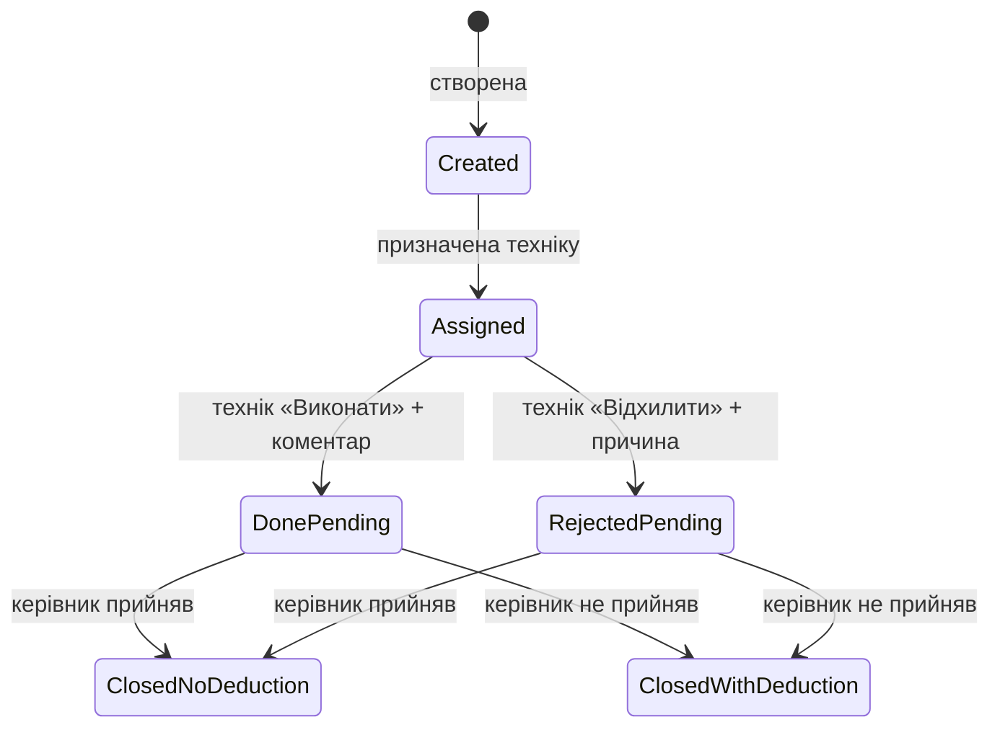

# TA: ERP «Водолій» — планувальник, автомати, фінанси, зарплата

**Status:** **Draft — product TA (not implemented)**  
**Sprint:** [ta-sprint.md](./ta-sprint.md) — **S0 ❌ · S1 ❌ · S2 ⚠️ · S3 ⚠️ · S4 ❌ · S5 ❌**  
**Owner / date:** 2026-08-10  
**Related:** [ta-sprint.md](./ta-sprint.md)  
**Channels:** веб-інтерфейс (керівник / фінансист) · Telegram-бот (технік)  
**Out of scope for v1 (див. §12):** фото в задачах; перегляд зарплати техніком; ролі Касир / Площина (лише зарезервовані)

---

## 1. Goal

Автоматизувати роботу сервісної компанії з мережею водних автоматів:

1. Управління користувачами та ролями.  
2. Облік автоматів і закріплення за одним техніком.  
3. Планувальник операційних і фінансових задач з контролем виконання.  
4. Збір витрат техніків (паливо / інші).  
5. Автоматичний щомісячний розрахунок зарплати.  
6. Фінансова аналітика та звітність.

---

## 2. Glossary

| Term | Meaning here |
|------|----------------|
| **автомат** | Водний автомат у мережі компанії |
| **технік** | Співробітник, відповідальний за свої автомати; працює через Telegram-бот |
| **керівник** | Адмін веб-кабінету: автомати, призначення техніків, перевірка задач, зарплата |
| **фінансист** | Створює фінансові задачі; переглядає зарплату та фінзвіти |
| **утримання із ЗП** | Сума, що може бути знята із зарплати після рішення керівника (**не** «штраф») |
| **операційна задача** | Сервісна/ремонтна задача від керівника |
| **фінансова задача** | Збір фінданих (одноразова або регулярна), від фінансиста / системи |
| **базова ставка** | `кількість_автоматів_техніка × 300 грн` за календарний місяць |
| **премія за продуктивність** | `кількість_автоматів_техніка × середні_літри_по_мережі × 0,07 грн` |
| **ручна премія** | Разове нарахування керівником/фінансистом (сума, причина, автор, дата) |

---

## 3. Roles & users (locked)

### 3.1 Roles

| Role | Channel (v1) | Primary duties |
|------|--------------|----------------|
| **Керівник** | Web | Автомати, призначення техніків, операційні задачі, перевірка задач, зарплата, звіти |
| **Технік** | Telegram | Свої автомати, свої задачі, щомісячний фінзвіт |
| **Фінансист** | Web | Фінансові задачі, зарплата, фінзвітність |
| **Касир** | — | Зарезервовано (v1 out of scope) |
| **Площина** | — | Зарезервовано (v1 out of scope) |

### 3.2 User fields

| Field | Required | Notes |
|-------|----------|--------|
| ім'я | yes | |
| прізвище | yes | |
| Telegram ID | yes | прив’язка до бота |
| role(s) | yes | розширювано без зміни ядра |

**Locked:** структура користувача може розширюватись модульно (§10).

---

## 4. Machines (автомати)

### 4.1 Baseline

На момент запуску перелік автоматів **вже є** в БД.

### 4.2 Machine fields (v1)

| Field | Required |
|-------|----------|
| назва | yes |
| адреса | yes |
| локація | yes |
| відповідальний технік | yes (рівно один) |

### 4.3 Assignment rules (locked)

| # | Rule | Value |
|---|------|--------|
| B1 | Ownership | Кожен автомат закріплений **лише за одним** техніком |
| B2 | Manager view | Керівник бачить усі автомати / фільтр по техніку |
| B3 | Reassign | Керівник змінює відповідального через web |
| B4 | After reassign | Автомат зникає у попереднього техніка і з’являється у нового |
| B5 | Technician view | У боті технік бачить **лише свої** автомати |

### 4.4 Technician machine card (Telegram)

| Field | Shown |
|-------|--------|
| назва | yes |
| адреса | yes |
| локація | yes |
| реалізована вода (літри) | yes |

---

## 5. Task planner

### 5.1 Create channels

| Channel | Status |
|---------|--------|
| Web | in scope |
| Telegram-bot | in scope |
| Exact UI | **TBD later** (не блокує модель даних) |

### 5.2 Task fields (locked)

| Field | Notes |
|-------|--------|
| назва | |
| опис | |
| база (локація) | |
| термін виконання | deadline |
| утримання із ЗП | ціле число грн; optional |
| виконавець(і) | див. B6 |

| # | Rule | Value |
|---|------|--------|
| B6 | Assignees | один співробітник **або** кілька **або** уся категорія (напр. усі техніки) |
| B7 | Deduction label | UI: **«Утримання із заробітної плати»**; слово «штраф» **заборонене** |
| B8 | Deduction values | лише **цілі** числа (напр. 500 / 1000 / 2500 грн) |

### 5.3 Task types (locked)

| Type | Created by | Purpose | Deduction allowed |
|------|------------|---------|-------------------|
| **Операційна** | Керівник | заміна лічильника, датчик, ремонт, ТО, … | yes |
| **Фінансова** | Фінансист / система | збір фінданих | n/a (звіт витрат) |

Фінансові задачі: **одноразові** або **регулярні** (напр. щомісячна задача кожному техніку).

---

## 6. Task lifecycle (locked)



### 6.1 Technician actions (Telegram)

| Action | Required input | Next status |
|--------|----------------|-------------|
| **Виконати** | коментар (фото — future) | **Очікує підтвердження / рішення керівника** |
| **Відхилити** | обов’язкова причина | **Очікує рішення керівника** |

Технік бачить: свої задачі, опис, дедлайн, суму можливого утримання.

### 6.2 Manager review (locked)

| # | Decision | Effect |
|---|----------|--------|
| B9 | Прийняв | задача **закрита**; утримання **не** застосовується |
| B10 | Не прийняв | задача **закрита**; застосовується утримання з картки задачі |

Керівник переглядає: задачу, відповідь техніка, коментар, статус.

---

## 7. Monthly financial report (technician)

Щомісяця система створює **фінансову задачу** кожному техніку.

### 7.1 Form fields

| Block | Fields | Example |
|-------|--------|---------|
| **Паливо** | сума; коментар | «За місяць обслужено 120 автоматів.» |
| **Інші витрати** | сума; коментар | парковка, мийка, інструмент, розхідники, інші |

### 7.2 Persisted record

| Field |
|-------|
| період |
| технік |
| сума палива + коментар |
| сума інших витрат + коментар |
| дата подання |

---

## 8. Payroll (зарплата)

### 8.1 Cadence & access

| # | Rule | Value |
|---|------|--------|
| B11 | Calculate | **один раз** на календарний місяць; результат зберігається |
| B12 | View (v1) | Керівник + Фінансист через **web** |
| B13 | View (future) | Технік: Telegram і/або web-кабінет |

### 8.2 Formula (locked)

| Component | Formula |
|-----------|---------|
| **Базова ставка** | `machines_count × 300 грн` |
| **Середні літри мережі** | `total_network_liters / network_machines_count` |
| **Премія за продуктивність** | `technician_machines_count × avg_liters_per_machine × 0,07 грн` |
| **Утримання** | сума всіх утримань, **підтверджених** керівником у періоді |
| **Ручні премії** | сума ручних премій за період |

```
salary =
  base_rate
  + performance_bonus
  + manual_bonuses
  − deductions
```

> **Clarification (locked):** у вихідному брифi між компонентами стояло `*`; математично і за змістом це **додавання** (`+`). Зафіксовано як `+`.

### 8.3 Manual bonus fields

| Field | Required |
|-------|----------|
| сума | yes |
| причина | yes |
| автор | yes |
| дата | yes |

### 8.4 Payroll detail view (manager / financier)

| Column |
|--------|
| кількість автоматів |
| базова ставка |
| середня кількість літрів |
| премія |
| ручні премії |
| утримання |
| підсумкова сума |

**Locked:** перегляд за **будь-який** календарний місяць.

---

## 9. Financial reporting

| # | Rule | Value |
|---|------|--------|
| B14 | Primary user | Фінансист |
| B15 | Also has access | Керівник |
| B16 | Default period | **поточний календарний місяць** |

### 9.1 Period presets

- останні 7 днів  
- поточний місяць  
- попередній місяць  
- останні 2 місяці  
- квартал  
- рік  
- довільний період  

### 9.2 Report sections

| Section | Summary | Drill-down |
|---------|---------|------------|
| **Паливо** | загальна сума | технік · сума · коментар |
| **Інші витрати** | загальна сума | технік · сума · коментар · дата |
| **Заробітна плата** | загальна сума зарплат | база · премія · ручні · утримання · підсумок |

---

## 10. Architecture principles (locked)

| # | Rule |
|---|------|
| S1 | Модульна ERP: нові ролі / типи задач / категорії витрат / формули / звіти / модулі — **без** переписування ядра |
| S2 | Розширення полів користувача й автомата — additive |
| S3 | Не змінювати вже реалізовані модулі при додаванні нових (backward-compatible) |

---

## 11. Acceptance criteria (product)

| # | Criterion |
|---|-----------|
| 1 | Керівник призначає/змінює відповідального техніка; списки техніків оновлюються |
| 2 | Технік у боті бачить лише свої автомати з літрами |
| 3 | Створення операційної/фінансової задачі з полями §5.2 |
| 4 | Технік: виконати/відхилити → статус очікує керівника |
| 5 | Керівник прийняв → без утримання; не прийняв → утримання застосовано |
| 6 | Щомісячна фінзадача: паливо + інші витрати зберігаються |
| 7 | Зарплата рахується за формулою §8.2 і доступна керівнику/фінансисту |
| 8 | Фінзвіт з пресетами періодів і drill-down §9.2 |
| 9 | UI ніде не використовує слово «штраф» |

---

## 12. Out of scope (v1)

- Фото до виконання задачі (передбачити в моделі пізніше).  
- Перегляд зарплати техніком у боті/кабінеті.  
- Повна реалізація ролей **Касир** / **Площина**.  
- Фінальний UX web/Telegram (окремо).  

---

## 13. Open questions

| # | Question | Status |
|---|----------|--------|
| Q1 | Точний UI створення задач (web vs bot first)? | Open |
| Q2 | Як рахувати `network_machines_count` / літри (усі автомати vs активні)? | Open |
| Q3 | Момент знімка «кількість автоматів техніка» для payroll (кінець місяця / середнє)? | Open |
| Q4 | Чи потрібні Касир / Площина у першому релізі? | Open — зараз out of scope |
| Q5 | Таймінг автостворення щомісячної фінзадачі (1-ше число / останній день)? | Open |

---

## 14. Decision log

| Date | Decision |
|------|----------|
| 2026-08-10 | Product TA зібрано з бізнес-брифу (розділи 1–18). |
| 2026-08-10 | Документ приведено до стилю MM_project `TZ` (Goal · Glossary · locked B/S · lifecycle · AC · OOS · Q · decision log). |
| 2026-08-10 | **Locked:** підсумкова зарплата = база **+** премія **+** ручні **−** утримання. |
| 2026-08-10 | **Locked:** UI-термін «Утримання із заробітної плати»; «штраф» заборонено. |
| 2026-08-10 | **Locked:** 1 автомат → 1 відповідальний технік. |
| 2026-08-10 | Додано sprint-план [ta-sprint.md](./ta-sprint.md) (S0–S5) у стилі MM_project. |
| 2026-08-10 | Audit: S2/S3 у sprint оновлено до ⚠️ (код задач + phone UI є; Telegram menus — gap). |
| 2026-08-10 | **Live ✅:** staff-bot `/start` → assign technician → task in bot (link) → phone complete. |
